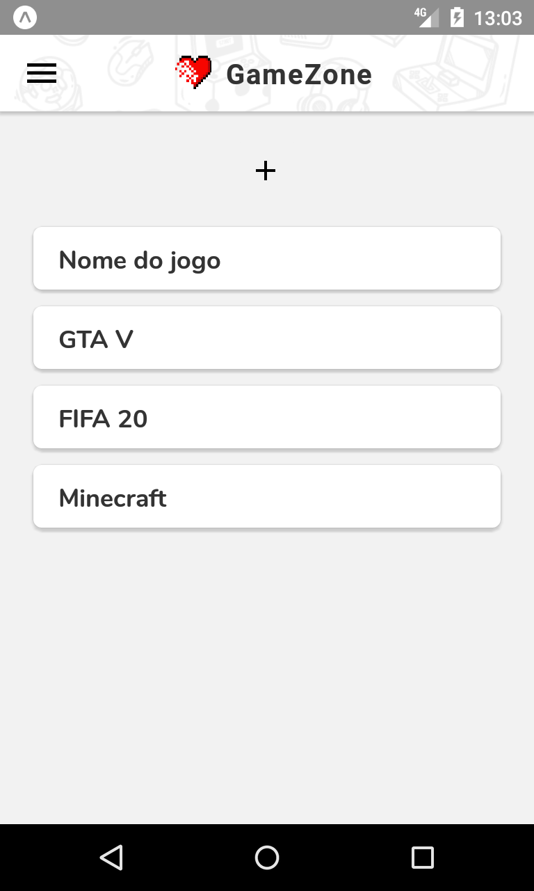

# GameZone
## Aplicativo para avalição de jogos

Aplicação de avaliações desenvolvida para estudos de React Native, React Navigation, formulários e validações utilizando Formik e Yup, além da criação de componentes customizados.

|                                                   |                                                     |                                                    |
| :------------------------------------------------ | :-------------------------------------------------: | :------------------------------------------------: |
|  |  |  |

|                               |                                                    |                                               |                                                |
| :---------------------------- | :------------------------------------------------: | :-------------------------------------------: | :--------------------------------------------: |
|  |  |  |  |
|                               |                                                    |                                               |                                                |

## Versões utilizadas:

- React Native 0.61
- React 16.9.0
- React DOM 16.9.0
- React Navigation 4.0.10
- Formik 2.1.2
- Yup 0.28.0
- Expo 36.0.0

### Referências:

- https://facebook.github.io/react-native/docs/getting-started
- https://docs.expo.io/versions/latest/
- https://reactnavigation.org/docs/en/getting-started.html
- https://jaredpalmer.com/formik/docs/overview
- https://github.com/jquense/yup
- http://bit.ly/36YtkOE